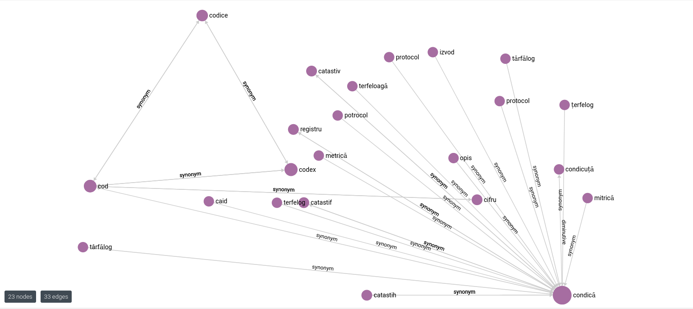
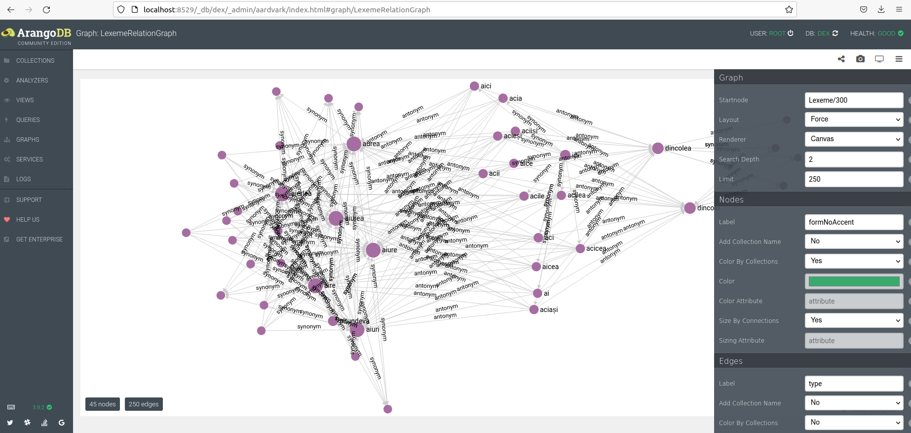

# codex

This Web API allows for migrating the database of the online Romanian Dictionary [DEXonline](https://dexonline.ro) into an ArangoDB graph database, with a number of searches able to be performed.

For startup, you can use the corresponding Docker Compose service. For example: 
~~~bash
sudo docker compose up --build
~~~
Stop the service (while preserving database data) with
~~~bash
sudo docker compose stop
~~~
And shut it down (removing database data) with
~~~bash
sudo docker compose down
~~~
By default, the service runs on [localhost:8080](http:/localhost:8080), with the database on [localhost:8529](http:/localhost:8529). The database is accessible by default with the credentials `user:root`, `password:openSesame`.
## Import

Before any searches can be executed, the database has to be imported. Data will be imported from the DEXonline's database initialization script (accesible by default [here](https://dexonline.ro/static/download/dex-database.sql.gz)) through SQL parsing. The import link can be configured in [application.properties](codex/src/main/resources/application.properties).

The import can be achieved in **two** phases:

* The first stage is meant to simulate the structure of the original SQL database, with searches being able to be executed in a similar manner as in SQL.
* The second represents an optimized and more compact version built off of the first, for more efficient searches. 

To avoid idle timeouts resulting from excessively large transactions, the import can be paginated, so that certain large queries will be split into smaller ones, leading to increased stability.

### How to import

To import the database into ArangoDB, use the following endpoint:
* `codex/import/import`: POST - parameters `boolean complete` (whether to also execute second phase of import, or only the first), `integer pagecount` (number of small subqueries to split large queries into - minimum 10 recommended - 0 for no pagination) - returns the string `Import complete` on a success

An example using curl to import into the first stage:
~~~bash
curl -H "Accept: application/json" -H "Content-Type:application/json" --data '{"complete": false, "pagecount": 10}' -X POST "localhost:8080/codex/import/import"
~~~

A partial import (at only the first stage) can also be led into the second using the endpoint:
* `codex/import/optimize`: POST - parameter `integer pagecount` - returns the string `Import complete` on a success:
~~~bash
curl -H "Accept: application/json" -H "Content-Type:application/json" --data '{"pagecount": 10}' -X POST "localhost:8080/codex/import/optimize"
~~~

Before starting a new import, and on any errors during import, content of the database will be deleted, to avoid conflicts.

To verify the results, you can enter the database's web interface:

* Access the database (default [localhost:8529](http:/localhost:8529)) in a web browser
* login (default username `root`, password `openSesame`)
* access the database `dex`

### Visualisation
On an **optimized** import, a graph depicting lexemes and their relations will be automatically generated for visualization.

To visualise from inside the database web interface:

* Go to `Graphs` and select `LexemeRelationGraph`
* click on the top right `≡` button
* Recommended to set Nodes Label to `formNoAccent` and Edges Label to `type` in the settings on the right
* Enter an ArangoDB _id (`Lexeme/(number)`, for instance `Lexeme/345`) inside `Graph StartNode`

Result should look similar to this:

To visualise starting from a desired word, you can find the word's `_id` by going into the `Queries` tag on the left and using the following query (make sure to set the value of the `word` bind parameter on the right):
~~~arangodb
for l in Lexeme
filter l.formNoAccent == @word
return l._id
~~~
Then use the respective ID (without commas) as the start node in Graph View.

Each stage has its own corresponding endpoints which can be called for searches (further described in [Search Endpoints](#search-endpoints)). For example, to get meanings of a word:
* For initial import stage: `codex/search/meanings`
* For optimized import stage: `codex/optimizedsearch/meanings`

## Search Endpoints
After importing the database in one of its two stages, the following endpoints can be used for searches.

Endpoints for searches have a number of similar fields: `wordform` represents the form to search against (either `accent` for accented forms, or `noaccent` for forms without accent: for example `abager'ie` vs. `abagerie` ), `relationtype` represents a relationship between two words (`synonym`, `antonym`, `diminutive` or `augmentative`). 

All searches are case sensitive and diacritics-sensitive.

Some endpoints function only for the first import stage, while others only for the second. Their functionalities are similar, but searches are executed in a different manner: while the first rely on graph traversals, the second rely on simple lookups, leading to a performance boost.
### Endpoints only for initial import
* `codex/search/meanings`: POST - parameters `String word`, `String meaningtype` (`proper_meaning`, `etymology`, `usage_example`, `comment`, `diff`, `compound_meaning`(Meanings of compound expressions containing word)), `String wordform` - returns array of strings representing "meanings" with given `meaningtype` of `word`:
~~~bash
curl -H "Accept: application/json" -H "Content-Type:application/json" --data '{"word": "bancă", "meaningtype": "proper_meaning", "wordform": "noaccent"}' -X POST "localhost:8080/codex/search/meanings"
~~~
* `codex/search/relation`: POST - parameters `String word`, `String relationtype`, `String wordform` - returns array of strings representing words with given `relationtype` to `word`
~~~bash
curl -H "Accept: application/json" -H "Content-Type:application/json" --data '{"word": "alb", "relationtype": "antonym", "wordform": "noaccent"}' -X POST "localhost:8080/codex/search/relation"
~~~
### Endpoints only for optimized import
* `codex/optimizedsearch/meanings`: POST - parameters `String word`, `String wordform` - returns array of strings representing meanings of `word`
~~~bash
curl -H "Accept: application/json" -H "Content-Type:application/json" --data '{"word": "mașină", "wordform": "noaccent"}' -X POST "localhost:8080/codex/optimizedsearch/meanings"
~~~
* `codex/optimizedsearch/etymologies`: POST - parameters `String word`, `String wordform` - returns array of objects representing etymologies of `word`. These objects represent pairings of the etymology's original word, and a tag describing its origin (language), both represented as strings.
~~~bash
curl -H "Accept: application/json" -H "Content-Type:application/json" --data '{"word": "bancă", "wordform": "noaccent"}' -X POST "localhost:8080/codex/optimizedsearch/etymologies"
~~~
* `codex/optimizedsearch/usageexamples`: POST - parameters `String word`, `String wordform` - returns array of strings representing usage example phrases containing `word`
~~~bash
curl -H "Accept: application/json" -H "Content-Type:application/json" --data '{"word": "bancă", "wordform": "noaccent"}' -X POST "localhost:8080/codex/optimizedsearch/usageexamples"
~~~
* `codex/optimizedsearch/relation`: POST - parameters `String word`, `String relationtype`, `String wordform` - returns array of strings representing words with given `relationtype` to `word`
~~~bash
curl -H "Accept: application/json" -H "Content-Type:application/json" --data '{"word": "alb", "relationtype": "antonym", "wordform": "noaccent"}' -X POST "localhost:8080/codex/optimizedsearch/relation"
~~~
### Endpoints usable for any stage of import
* `codex/search/levenshtein`: POST - parameters `String word`, `Integer distance`, `String wordform` - returns array of words with a Levenshtein distance of maximum `dist` from `word`, using the specified `wordform`
~~~bash
curl -H "Accept: application/json" -H "Content-Type:application/json" --data '{"word": "ecumenic", "distance": 3, "wordform": "noaccent" }' -X POST "localhost:8080/codex/search/levenshtein"
~~~
* `codex/search/regex`: POST - parameter `String regex`, `String wordform` - returns array of strings representing words matching the Regex expression `regex` using specified `wordform`. (ArangoDB has its own Regex syntax, as described [here](https://www.arangodb.com/docs/stable/aql/functions-string.html#regular-expression-syntax))

How the project's name was found :) (request below returns words containing the string "dex")
~~~bash
curl -H "Accept: application/json" -H "Content-Type:application/json" --data '{"regex": "%dex%", "wordform": "noaccent" }' -X POST "localhost:8080/codex/search/regex"
~~~
#### KNN Endpoints
* `codex/knn/editdistance`: POST - parameters `String word`, `String wordform`, `String distancetype` (either `levenshtein`, `hamming` or `lcs_distance`), `Integer neighborcount` - returns array of strings representing K nearest neighbors using given `distancetype`
~~~bash
curl -H "Accept: application/json" -H "Content-Type:application/json" --data '{"word": "anaaremere", "wordform": "noaccent", "distancetype": "lcs_distance", "neighborcount": 10}' -X POST "localhost:8080/codex/knn/editdistance"
~~~
* `codex/knn/ngram`: POST - parameters `String word`, `String wordform`, `String distancetype` (either `ngram_similarity` (as described [here](https://www.arangodb.com/docs/stable/aql/functions-string.html#ngram_similarity)) or `ngram_positional_similarity` (as described [here](https://www.arangodb.com/docs/stable/aql/functions-string.html#ngram_positional_similarity))), `Integer neighborcount`, `Integer ngramsize` - returns array of strings representing K nearest neighbors using given N-gram `distancetype` and given `ngramsize`
~~~bash
curl -H "Accept: application/json" -H "Content-Type:application/json" --data '{"word": "anaaremere", "wordform": "noaccent", "distancetype": "ngram_similarity", "neighborcount": 10, "ngramsize": 3}' -X POST "localhost:8080/codex/knn/ngram"
~~~
### Sandbox/Testing endpoints
* `codex/system/schema/collection`: GET - returns array of collections in database
* `codex/system/schema/key_types`: POST - parameter `String collection` - for each key in collection, returns types of values: response represented as array of key-type pairs
* `codex/system/collection/is_edge_collection`: POST - parameter `String collection` - returns a boolean value representing whether collection is edge collection
* `codex/system/collection/edge_relations`: POST - parameter `String collection` - return an array of string pairs, representing each pair of collections connected in specified edge collection
* `codex/system/schema/key_types_all`: GET - returns key types of all collections, as a JSON object in a format of `collection: key_types`, for each collection, as in `key_types` endpoint
* `codex/system/schema/edge_relations_all`: GET - returns edge relations of all collections, as a JSON object in format of `collection: edge_relations` for each collection, as in `edge_relations` endpoint
* `codex/system/schema/schema`: GET - documents and returns schema of database, in format `{keyTypeMap: key_types_all, edgeRelationsMap: edge_relations_all}`, as in previous two requests
* `codex/import/version`: GET - returns ArangoDB database version

## Import configuration through schema files
The structure of the database during each of the import stages is defined by the schema files [import-schema.json](codex/src/main/resources/import-schema.json) and [final-schema.json](codex/src/main/resources/final-schema.json) respectively, which describe the collections (SQL tables) and attributes (SQL columns) to be imported, along with validation rules for each, to ensure integrity of data. 

As of now, the second phase is centered around data of lexemes (essentially words, with homonyms having separate lexemes each). The [Lexeme](https://github.com/dexonline/dexonline/wiki/Database-schema%3A-the-Lexeme-table) collection will be updated so that a lexeme's meanings, usage examples and etymologies will be inserted inside the lexeme document instead of being stored in other collections, so that they can be accesed using lookups instead of graph traversals. Additionally, the edge collection [Relation](https://github.com/dexonline/dexonline/wiki/Database-schema%3A-the-Relation-table) will be changed to describe relations between two Lexemes, such as synonyms and antonyms. In doing so, lexemes with a given relation can be accesed with a simple graph traversal of distance 1, instead of traversing multiple unrelated collections, or complicated joins in SQL.

For each of these import phases, specified tables and attributes present in the SQL script will be imported. To understand the original SQL database's structure, find its documentation [here](https://github.com/dexonline/dexonline/wiki/Database-Schema).

The schema documents contain root fields describing three types of collections: 
* `collections`, containing descriptions of document collections (analogous to SQL tables). An example of the predefined schema of the [Meaning](https://github.com/dexonline/dexonline/wiki/Database-schema%3A-the-Meaning-table) collection:
~~~json
    "Meaning":{
      "rule":{
        "description":"Meanings are hierarchical: there are main meanings which can have secondary meanings, tertiary meanings and so on. See veni (https://dexonline.ro/definitie/veni/sinteza) for an example.",
        "properties":{
          "parentId":{
            "description":"The ID of the parent meaning in the tree. 0 or NULL means that this meaning is a root.",
            "type":"integer"
          },
          "type":{
            "description":"0 - (proper) meaning, 1 - etymology, 2 - a usage example from literature, 3 - user-defined comment, 4 - diff from parent meaning, 5 - compound expression meaning",
            "type":"integer",
            "enum": [0, 1, 2, 3, 4, 5]
          },
          "treeId":{
            "description":"Tree to which the meaning belongs.",
            "type":"integer"
          },
          "internalRep":{
            "description":"The meaning text.",
            "type":"string"
          }
        }
      },
      "level":"strict",
      "message":"Meaning could not be inserted!"
    }
~~~
* `edgeCollections`, which describe relationships between documents in collections (similar to many-to-many SQL tables). 
Edge collection objects contain three fields: `schema` contains the aforementioned ArangoDB schema specification object, and `from` and `to` describe the collections with the given relationship. An example for the predefined collection `EntryLexeme`, describing a relationship between entries and lexemes:
~~~json
"EntryLexeme":{
      "schema":{
        "rule":{
          "properties": {
          }
        },
        "level":"strict",
        "message":"EntryLexeme edge could not be inserted!"
      },
      "from":"Entry",
      "to":"Lexeme"
    },
~~~
* `generatedEdgeCollections`: edge collections generated automatically, meant to simulate SQL one-to-many relationships, and built using attributes of the "child" collection `attributeCollection`. These generated collections are built automatically in the first phase of the import after other collections are imported, and are meant to be used during the second phase, then deleted after import is finished. They contain three fields: `attributeCollection` represents the child collection whose attributes will be used to generate edges, and `from` and `to` represent objects containing two fields: `collection` and `attribute`, describing collections with the given relationship, and respectively the attribute inside `attributeCollection` which represents their SQL primary key / foreign key. For instance, the predefined generated edge collection `MeaningMeaning`, representing the hierarchy between Meanings:
~~~json
"MeaningMeaning":{
      "attributeCollection":"Meaning",
      "from":{
        "collection":"Meaning",
        "attribute":"parentId"
      },
      "to":{
        "collection":"Meaning",
        "attribute":"_key"
      }
    },
~~~

Inside the schema specification files, each document collection and edge collection contains an [ArangoDB Schema validation object](https://www.arangodb.com/docs/stable/data-modeling-documents-schema-validation.html) (at `collections.(name)` and `edgeCollections.(name).schema` respectively). Its `rule` property describes a [JSONschema object](https://json-schema.org/learn/getting-started-step-by-step.html) against which all documents imported into the collection will be validated, throwing an error on any mismatches.

Only the collections and attributes specified inside these fields will be imported. Collections and attributes can be specified only in the original import schema (in which case they will be used during the optimization phase, and then deleted), or specified in both schema files, in which case they will be preserved after optimization.

For example, the SQL database contains the table `Definition` (described in the documentation [here](https://github.com/dexonline/dexonline/wiki/Database-schema%3A-the-Definition-table)). To add it to the import along with the attribute `internalRep` (the definition's text) and the attribute `status` (numeric code of 0, 1, 2, or 3) both of which are defined as SQL columns inside the documentation, add the following to the `collections` of `import-schema.json`:
~~~json
"Definition": {
      "rule": {
        "properties": {
          "internalRep": {
            "type": "string"
          },
          "status": {
            "type": "integer",
            "enum": [0, 1, 2, 3]
          }
        }
      },
      "level": "strict",
      "message": "Definition could not be inserted!"
    }
~~~
The level `strict` will stop the import if any imported documents do not respect this schema (if `internalRep` is not a string, or if `status` is not an integer with a value of 0, 1, 2 or 3), throwing the error message `message` on errors. This collection will be imported during the first stage of the import, but will be deleted during the second if not also specified in `final-schema.json`.

Any changes in import schema files will only be reflected inside the docker compose service if it is rebuilt, such as with `sudo docker compose build`!

When importing into the corresponding collection, these base properties will always be imported:
* for document collections, `_key` - equivalent to SQL primary key
* for edge collections and generated edge collections, `_from` and `_to`, equivalent to foreign keys of many-to-many SQL tables

Thus, all many-to-many tables in the SQL schema should be imported as edge collections, while other tables as document collections. 

JSONschema validation does not work for these base properties, so they should not be specified inside the JSONschema object.

Other than these, only the specified properties (SQL columns) of a document will be imported. ArangoDB data types of document fields will be predetermined based on their corresponding SQL column data type.

It is highly recommended not to remove any of the predefined collections or attributes, as this may affect functionality of searches! (They were designed with the predefined schema in mind). However, any other collections or attributes present in the original SQL schema can be imported.

Also, be advised that any changes in the import schema files will only be registered by the `docker compose` service if it is rebuilt, for example by starting it with the `--build` flag:
~~~bash
sudo docker compose up --build
~~~

## Performance tests
The folder `tests` contains a number of Jmeter performance / load tests. Many also have `not_null` and `null` versions, which perform requests returning only non null values, and null values respectively.

Number of threads, rampup time and number of loops can be specified through the command line parameters `-Jthreads`, `-Jrampup` and `-Jloops` respectively (default value is 1 for each).

Ramp-up time represents the amount of time in seconds necessary for all testing threads to start: for example, for 5 threads and a ramp-up time of 10, a request will be sent every 10/5 = 2 seconds. This sequence will be executed an amount of times equal to the number of loops.

Be advised that tests for non-optimized `meanings`, `etymologies`, `usageexamples`, `synonyms`, `antonyms`, `diminutives` and `augmentatives` call endpoints only working for the first stage of import, while `optimized` versions work only for the second. In this manner, performance between the two can be compared.

Available tests are as follows:
* For import:
    * import_partial
    * import_full
    * import_optimize
* For initial import stage:
    * Antonyms:
        * antonyms
        * antonyms_non_null
        * antonyms_null
    * Augmentatives:
        * augmentatives
        * augmentatives_non_null
        * augmentatives_null
    * Diminutives:
        * diminutives
        * diminutives_non_null
        * diminutives_null
    * Etymologies:
        * etymologies
        * etymologies_non_null
        * etymologies_null
    * Meanings:
        * meanings
        * meanings_non_null
        * meanings_null
    * Synonyms:
        * synonyms
        * synonyms_non_null
        * synonyms_null
    * Usage examples:
        * usageexamples
        * usageexamples_non_null
        * usageexamples_null
* For optimized import stage:
    * Antonyms:
        * optimized_antonyms
        * optimized_antonyms_non_null
        * optimized_antonyms_null
    * Augmentatives:
        * optimized_augmentatives
        * optimized_augmentatives_non_null
        * optimized_augmentatives_null
    * Diminutives:
        * optimized_diminutives
        * optimized_diminutives_non_null
        * optimized_diminutives_null
    * Etymologies:
        * optimized_etymologies
        * optimized_etymologies_non_null
        * optimized_etymologies_null
    * Meanings:
        * optimized_meanings
        * optimized_meanings_non_null
        * optimized_meanings_null
    * Synonyms:
        * optimized_synonyms
        * optimized_synonyms_non_null
        * optimized_synonyms_null
    * Usage examples:
        * optimized_usageexamples
        * optimized_usageexamples_non_null
        * optimized_usageexamples_null
* For any import stage:
    * levenshtein
    * regex
    * knn:
        * knn_hamming
        * knn_lcs
        * knn_levenshtein
        * knn_ngram_similarity
        * knn_ngram_positional_similarity

To start one of the tests, use the following two commands inside the repo root directory (detailed explanation [here](https://www.perfmatrix.com/jmeter-docker-test-executions/)):
~~~bash
TEST=knn_levenshtein
TESTS_PATH=${PWD}/tests && sudo docker run -v ${TESTS_PATH}:/workspace --net=host swethapn14/repo_perf:JmeterLatest -Jthreads=100 -Jrampup=10 -Jloops=1 -n -t /workspace/${TEST}/${TEST}.jmx -l /workspace/logs/${TEST}.jtl -f -e -o /workspace/html/${TEST}
~~~
Change the value of TEST to the desired test directory name, and set command line arguments starting with -J accordingly. Some tests also have additional optional command line parameters:

* for import tests, `-Jpagecount` for the number of pages (default 10), 
* for KNN tests, `-Jneighborcount` for the number of neighbors (default 5),
* for N-gram tests, `-Jngramsize` for the n-gram size (default 2)

This will store an HTML summary of the test results in `tests/html/{testname}`, and a log file in `tests/logs/{testname}`.

### Performance Sheet

A set of test results can be found in a performance sheet [here](images/codex_performance_sheet.pdf). These tests were ran inside an Ubuntu virtual machine, with 16 GB of RAM and 4 CPUs. For the import tests, command line arguments were `-Jthreads=1 -Jrampup=1 -Jloops=10`, to run 10 consecutive imports, one at a time. For other tests, command line arguments were `-Jthreads=100 -Jrampup=10 -Jloops=1`; all other -J arguments were left with their default values.

## Known issues/limitations
* `"java.io.IOException: Reached the end of the stream"` error: caused by an exceedingly large transaction surpassing [ArangoDB's stream transaction idle timeout](https://www.arangodb.com/docs/stable/transactions-stream-transactions.html). The default timeout is 60 seconds, and this is mitigated somewhat by having the server option `--transaction.streaming-idle-timeout` set to the maximum possible value of 120 seconds in the database's Dockerfile. Nevertheless, ArangoDB is not built with large transactions in mind, so it is recommended to split any large transactions into smaller ones, such as by increasing the `pagecount` when importing.
* Searches for diminutives or augmentatives are not heavily supported; very few of these relationships exist in the original SQL database. The main focus for relation searches is on synonyms, and to a lesser extent antonyms.
* Most lexemes in common use contain meanings extracted from their definitions, for easier presentation in a tree format; some in lesser use do not have meanings extracted separately, but they do have definitions extracted directly from dictionaries, presented in the website and stored in the SQL table `Definition`
* For some lesser used lexemes, DEXonline redirects to content of a more used version (for example Rosa -> trandafir), whose usage examples and etymologies may not always contain/describe the same word, but another form or synonym of it
